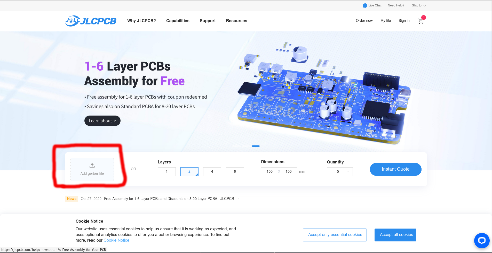
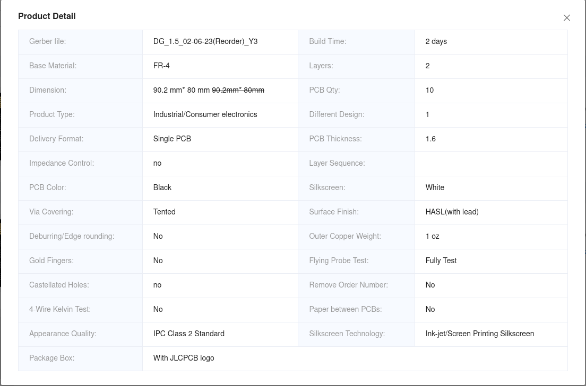
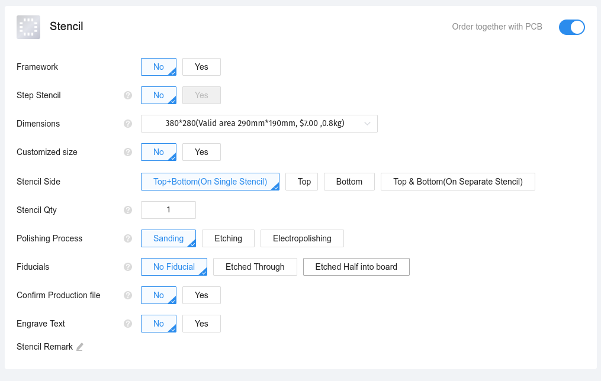

# Board Fabrication and Assembly Guide

#### Table of Contents

| Link | Description |
| :---: | :---: | 
| [Fabrication and Assembly Overview](#fabrication-and-assembly-overview)| Enumerates the basic steps for having a board manufactured and then assembling it. |
| [Terms and Definitions](#terms-and-definitions) | Terms used in these guides to describe the process of producing fully functional Data Gators. |

#### Fabrication and Assembly Overview

1. _**optional** modify schematics and designs_
2. Acquire PCBs and order components.
3. Assemble PCBs with all surface mount components.

    * Apply solder paste.
    * Place components.
    * Use hot plate/reflow oven/soldering iron to solder components.
    * Check components for bridges with magnifying glass and rework with soldering iron to remove bridges.

4. Solder through-hole components.
5. Connect separate boards and make cables.
6. _**optional** apply antenna mod for external antenna_

#### Terms and Definitions

A few terms are defined below to hopefully make this more readable for those with minimal prior experience. If you have questions and would like to see this guide expanded in some way, please create an issue for the repository and ask away!

| Term | Definition |
| :---: | :---: | 
| Fabrication | Refers to having a printed circuit board (PCB) manufactured without components, simply a layered board with vias and pads for components. Not something you should attempt yourself, this part of the process must be contracted through a third-party fab house. |
| Assembly | Refers to the process of installing components (surface mount and through-hole) on the PCB. Surface mount components often require more knowledge or special equipment to solder while through-hole components can usually be soldered with just a soldering iron and solder! This guide addresses some methods for those without the optimal equipment to get the job done with some simple and not too unusual tools that can be acquired cheaply. | 
| Reflow | Heating up solder to the point that it "flows" to form a solder joint between the component and the board pad. |

# How to Acquire Data Gator PCBs

PCB fabrication equipment is expensive so it follow the steps below to order PCB fabrication from a 3rd party vendor unless you have your own stuff.

## Ordering from [JLCPCB](https://jlcpcb.com/) and [PCBWay](https://www.pcbway.com/) and [Osh Park](https://oshpark.com/)

All three companies provide similar services including:

1. Online automated quotes based on: board quantity, size, and materials.
2. Add-on services: PCB assembly, stencil fabrication, etc.

#### Vendor Experience

These options allow a lot of flexibility, an accommodate all the requirements of getting the Data Gator boards made. Experience with each company might vary slightly. For example, I experienced:

* slower fabrication and shipping times with Osh Park (up to a week longer) whereas JLCPCB has a turn around of less than two weeks, ideal for prototyping.
* JLCPCB assembly services were buggy as of August, 2023, preventing double sided SMD component assembly.
* PCBWay provided good assembly and board fabrication, slightly lower mask quality than the other two and a fair amount of engineer interaction for assembly process (a good thing for working through issues).

Osh Park has the advantage of being based in the USA and offers various tiers of production speed, which may appeal if working on a government project.

### JLCPCB Steps (Can use for the others as well!)

In most cases to fabricate the board, you will upload the board as a Gerber file through the link on the manufacturer's website using the links above. Data Gator PCB Gerber files can be found by navigating to [hardware revisions](../Hardware_Revisions/README.md).

1. Navigate to site.
2. Upload Gerber using site link. Click Upload Gerber -> select zipped gerber file.

    

3. Use configuration menu pictured below to set preferences for board fabrication. _**Note:**_ default options are sufficient, though the options used for this project are provided in the screenshot below if you wish to check.
    
    

4. Choose add-on services. _**Note:**_ the selected options are defaults from the site and may need to be changed based on your equipment and usage and are not meant to be copied.

    * if you have a [stencil printer](https://www.amazon.com/s?k=stencil+printer+pcb&i=tools&crid=286I7CTV6K4RE&sprefix=stencil+printer+pcb%2Ctools%2C154&ref=nb_sb_noss), you will likely want to select the framework option for the stencil as this means you will receive a frame holding a tensioned stencil.

    * assembly requires additional steps, so there will be an additional guide written for this.

    

    
