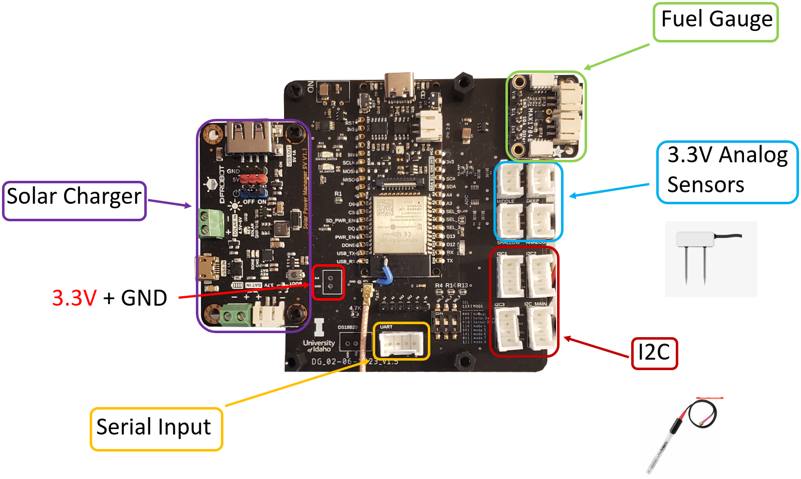
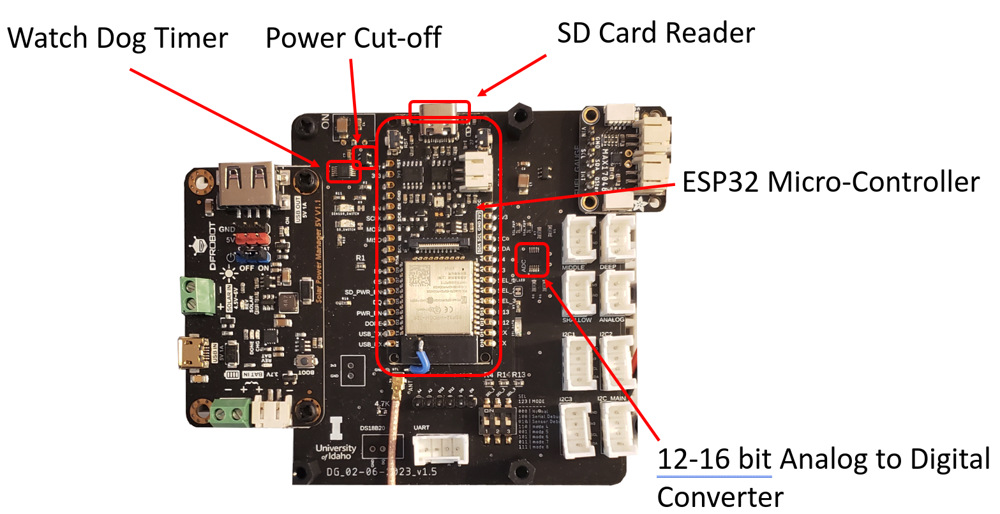
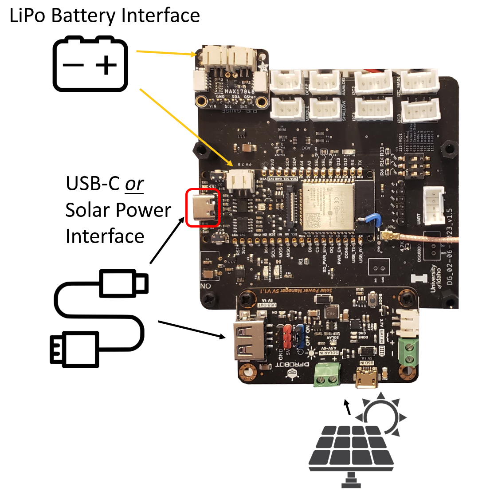

# Hardware
Documents how to build and use Data Gator boards.

| Resource | Description |
| :---: | :---: | 
| [Hardware Revision Design Files](./Hardware_Revisions/README.md) | Links to board design files for v1.4 and later. Contains electrical design schematics, BOMs, CAD, and assembly automation files. |
| [Sensors and Wiring Guides](./Senosrs_And_Wiring/README.md) | Links to guides for using various supported sensors with the Data Gators. |
| [Board Assembly Guides](./Board_Assembly_Guides/README.md) | Documentation for self-assembly of surface mount and through-hole components for the Data Gators. |

## Hardware Overview

The images below show various components incorporated into the Data Gator carrier board design. 

